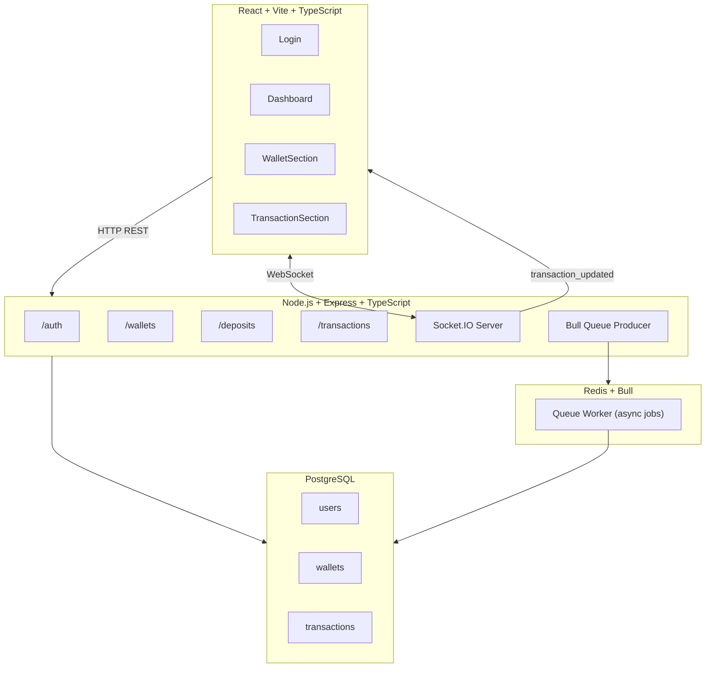

# BotCalm — Real-Time Deposit Processing System

## Overview
BotCalm is a full-stack real-time deposit processing system built with Node.js, TypeScript, and React. It handles wallet registration, deposit ingestion, and asynchronous transaction processing via a Bull/Redis queue. Transactions are processed with full idempotency guarantees — duplicate submissions are safely rejected at the database level using PostgreSQL's conflict resolution. A Socket.IO WebSocket layer pushes live status updates to the dashboard the moment a transaction is processed, without any polling.

## Tech Stack

| Layer | Technology | Reason |
| :--- | :--- | :--- |
| Runtime | Node.js 18 + TypeScript | Type safety, production-grade code quality |
| Framework | Express.js | Lightweight, flexible REST API |
| Database | PostgreSQL 15 | ACID guarantees critical for financial transaction data |
| Queue | Bull + Redis | Decouples deposit ingestion from processing, enables async retry |
| WebSockets | Socket.IO | Real-time transaction status updates without polling |
| Frontend | React 18 + Vite + TypeScript | Fast development, type-safe UI |
| Styling | Tailwind CSS | Utility-first, consistent design system |
| Monorepo | Turborepo + pnpm | Shared tooling, parallel builds |
| Auth | JWT + bcryptjs | Stateless authentication, secure password hashing |
| Logging | Winston | Structured JSON logs for observability |
| Testing | Jest + ts-jest + Supertest | Type-safe integration tests |
| Containers | Docker + Docker Compose | One-command reproducible environment |

## Architecture



## Deposit Flow
1. Client sends POST `/api/v1/deposits` with JWT auth
2. Server validates request and checks wallet exists
3. `INSERT ... ON CONFLICT (transaction_hash) DO NOTHING` — idempotency at DB level
4. New transaction stored as 'pending'
5. Job added to Bull queue in Redis
6. HTTP response returned immediately (non-blocking)
7. Bull worker picks up job asynchronously
8. Worker simulates processing (1s delay representing blockchain confirmation)
9. Status updated to 'processed' or 'failed'
10. Callback triggered with exponential backoff retry
11. Socket.IO emits `transaction_updated` to all connected clients
12. Dashboard updates in real-time without page refresh

## Key Design Decisions

### Idempotency
PostgreSQL unique constraint on `transaction_hash` combined with `INSERT ... ON CONFLICT DO NOTHING` guarantees that duplicate deposits are silently ignored at the database level — no application-level locking needed, safe under concurrent requests.

### Concurrency Safety
Each deposit uses a dedicated pg client with `BEGIN/COMMIT` transaction block. The wallet existence check and transaction insert happen atomically, preventing race conditions.

### Async Processing
Bull queue decouples the HTTP request from the actual processing work. The API responds in milliseconds while heavy work (processing, callbacks, retries) happens in the background worker.

### Exponential Backoff
Failed callbacks retry with delay = `2^attempt * 1000ms` (2s, 4s, 8s). Prevents thundering herd against struggling external systems.

### Type Safety
All shared data shapes (`Transaction`, `Wallet`, `TransactionStatus`) are defined as TypeScript interfaces. The `TransactionStatus` union type (`'pending'` | `'processed'` | `'failed'`) prevents invalid status strings at compile time.

### camelCase Mapping
PostgreSQL returns `snake_case` column names. The `toTransaction()` and `toWallet()` mapper functions in `config/db.ts` convert to `camelCase` at the database boundary so all application code works with consistent naming.

## Project Structure
```text
botcalm-deposit-system/
├── apps/
│   ├── backend/
│   │   ├── src/
│   │   │   ├── config/        # DB pool, Redis client
│   │   │   ├── middleware/    # Auth, error handler
│   │   │   ├── migrations/    # SQL schema
│   │   │   ├── routes/        # Auth, wallets, transactions
│   │   │   ├── services/      # Business logic
│   │   │   ├── socket/        # Socket.IO setup
│   │   │   ├── types/         # TypeScript interfaces
│   │   │   ├── utils/         # Logger
│   │   │   ├── workers/       # Bull queue processor
│   │   │   ├── app.ts         # Express app (no side effects)
│   │   │   └── server.ts      # Entry point, starts server
│   │   └── tests/             # Integration tests
│   └── frontend/
│       └── src/
│           ├── api/           # Axios instance + API calls
│           ├── components/
│           │   ├── ui/        # Button, Badge, Card, FormInput
│           │   ├── login/     # Login, LoginForm, LoginLeftPanel
│           │   └── dashboard/ # Dashboard, Navbar, Wallet*, Transaction*
│           ├── context/       # AuthContext, ToastContext
│           ├── hooks/         # useSocket
│           └── types/         # Frontend TypeScript interfaces
├── docker-compose.yml
└── turbo.json
```

## Setup Instructions

### Option A — Docker (recommended for reviewers)
Requirements: Docker Desktop

```bash
git clone <repo-url>
cd botcalm-deposit-system
docker-compose up --build
```

Then open:
- Frontend: http://localhost:3000
- Backend API: http://localhost:5001
- Health check: http://localhost:5001/health
- Default credentials: `admin` / `admin123`

### Option B — Local Development
Requirements: Node.js 18+, pnpm, PostgreSQL 15, Redis 7

```bash
# Install dependencies
pnpm install

# Create database
psql -U postgres -c "CREATE DATABASE botcalm;"

# Start services (in separate terminals)
cd apps/backend && pnpm dev
cd apps/frontend && pnpm dev
```

Then open http://localhost:5173

### Run Tests
```bash
# Create test database first
psql -U postgres -c "CREATE DATABASE botcalm_test;"

cd apps/backend
pnpm test
```

## API Documentation

### Authentication
`POST /api/v1/auth/login`
- Body: `{ "username": "admin", "password": "admin123" }`
- Response: `{ "token": "...", "username": "admin" }`
- No auth required

### Wallets
`GET /api/v1/wallets` — returns all wallets (auth required)
`POST /api/v1/wallets` — creates wallet (auth required)
- Body: `{ "address": "0x..." }`
- Errors: 400 missing address, 409 duplicate

### Deposits & Transactions
`POST /api/v1/deposits` — submit deposit (auth required)
- Body: `{ "walletAddress": "0x...", "transactionHash": "0x...", "amount": 10.5 }`
- New: 201 + Transaction object (status: pending)
- Duplicate: 200 + `{ "duplicate": true }`
- Errors: 400 invalid fields, 404 wallet not found

`GET /api/v1/transactions` — paginated list (auth required)
- Query: `page`, `limit`, `status`, `walletAddress`
- Response: `{ "transactions": [...], "total": 10, "page": 1, "limit": 10, "totalPages": 1 }`

`GET /health` — health check (no auth)

### WebSocket Events
Connect: pass JWT in `socket.handshake.auth.token`
Event `transaction_updated`: emitted when any transaction status changes
Payload: full Transaction object

## Assumptions and Limitations
- Callback system is mocked (logged only) — production would POST to a real webhook URL
- Single admin user seeded at startup — no user registration UI
- No HTTPS — production would require reverse proxy (Nginx/load balancer) with TLS
- Rate limiting is per-IP, 100 requests per 15 minutes
- WebSocket connections require valid JWT — unauthenticated connections are rejected
- Amount precision: stored as `DECIMAL(20,8)` supporting up to 8 decimal places

## Bonus Features Implemented
- Background worker with Bull queue and Redis
- WebSocket real-time updates via Socket.IO
- Docker + Docker Compose setup
- Unit/integration tests with Jest + Supertest + ts-jest
- Pagination for transactions
- Filtering by status and wallet address
- Exponential backoff on callback retries
- Structured JSON logging with Winston
- Rate limiting with express-rate-limit
- API versioning (`/api/v1/`)
- Turborepo monorepo with pnpm workspaces
